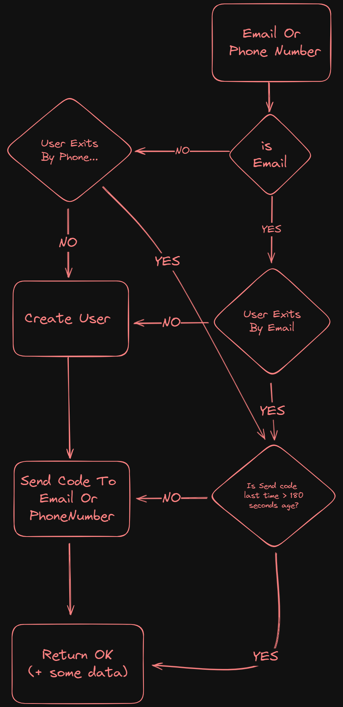
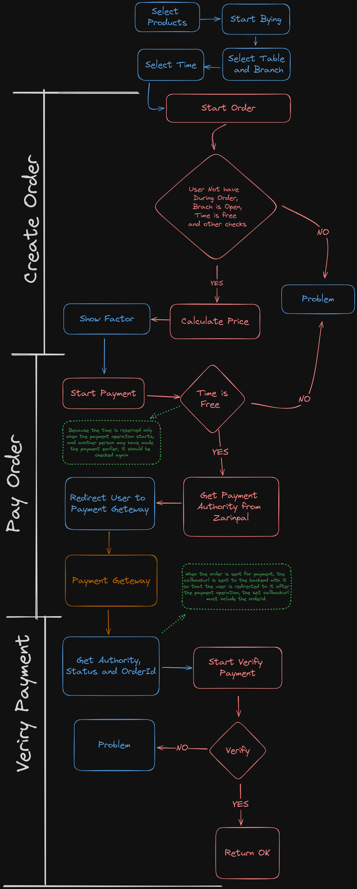

# Restaurant Api 🍽️

This project is a web api for **booking tables and food in chain restaurants**, it is not a complete project and there are many parts that can be added to it, my goal of this project is to practice `Clean Architecture` and design patterns such as `CQRS` and `Mediator`. If you fide a problem in this project or have an idea to improve it, I will be happy to tell you about it in the [issues section](https://github.com/taqinasiri/RestaurantApi/issues).

## Before Running 👨‍💻

Before running the app, change the connection string in the **[appsetting.json](src/Presentation/Restaurant.Api/appsettings.json)** file, You can also use **[this backup](docs/Restaurant.bak)** to have the data inside the database. If you have a problem restoring the backup, you can use **[this script](docs/DB.sql)** to create a database with the data.

> Note : if you set the connection string correctly, the program will automatically create the database in the first run

## Some main scenarios 👇

-   [Loing Register](#login-register-🚪)
-   [Order And Payment](#order-and-payment-💸)

### Login Register 🚪

-   First User Enter `Email or Phone Number`
-   Then checked according to the image below and code send
-   Then the code along with the email or phone number will be received from the client side, if it is correct, a `jwt token` will be returned

### Order and Payment 💸

